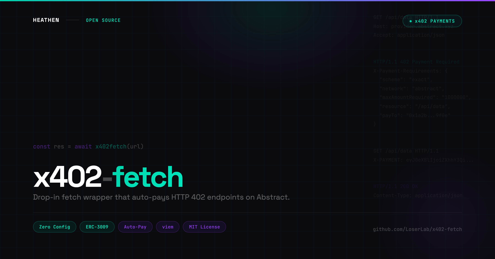

# x402-fetch

<p align="center">
  
</p>

Drop-in fetch wrapper that auto-pays HTTP 402 endpoints on Abstract.

One function. Wraps native `fetch()`, detects 402 responses, signs the payment, retries with the payment header. Zero config required.

## Install

```bash
npm install x402-fetch viem
```

`viem` is a peer dependency. You need it for wallet creation.

## Quick Start

```typescript
import { createX402Fetch } from "x402-fetch";
import { createWalletClient, http } from "viem";
import { privateKeyToAccount } from "viem/accounts";
import { abstractTestnet } from "viem/chains";

const wallet = createWalletClient({
  account: privateKeyToAccount("0x..."),
  chain: abstractTestnet,
  transport: http(),
});

const x402fetch = createX402Fetch(wallet);

// Use like normal fetch. Payments handled automatically.
const res = await x402fetch("https://api.example.com/premium-data");
const data = await res.json();
```

## How it works

1. Your code calls `x402fetch()` exactly like `fetch()`
2. If the server responds 200, the response passes through unchanged
3. If the server responds 402 Payment Required, the wrapper reads the payment requirements from the response body
4. It signs an ERC-3009 `transferWithAuthorization` using your viem wallet client
5. It retries the original request with the signed payment in the `X-PAYMENT` header (base64 JSON)

The server's facilitator verifies the signature and settles the payment onchain. Your code just gets the response.

## API Reference

### `createX402Fetch(wallet, config?)`

Returns a fetch function that handles 402 payment flows automatically.

**Parameters:**

| Parameter | Type | Description |
|---|---|---|
| `wallet` | `WalletClient` | A viem wallet client with an account and chain attached |
| `config` | `X402Config` | Optional configuration (see below) |

**Returns:** `(input: string \| URL \| Request, init?: RequestInit) => Promise<Response>`

### Types

```typescript
interface PaymentRequirements {
  x402Version: number;
  scheme: string;
  network: string;
  amount: string;
  asset: string;
  recipient: string;
  extra?: { name?: string; description?: string };
}

interface PaymentDetails {
  url: string;
  amount: string;
  asset: string;
  recipient: string;
  network: string;
  name?: string;
  description?: string;
}

interface X402Config {
  maxPayment?: string;
  onPayment?: (details: PaymentDetails) => void | Promise<void>;
}
```

## Configuration

### `maxPayment`

Set a ceiling on automatic payments. If a server requests more than this amount, the wrapper throws instead of signing.

```typescript
const x402fetch = createX402Fetch(wallet, {
  maxPayment: "0.01", // in token units
});
```

### `onPayment`

Callback invoked before each payment is signed. Useful for logging, analytics, or user confirmation flows.

```typescript
const x402fetch = createX402Fetch(wallet, {
  onPayment: (details) => {
    console.log(`Paying ${details.amount} to ${details.recipient} for ${details.name}`);
  },
});
```

## Part of the Abstract Developer Toolkit

| Tool | What it does |
|------|-------------|
| **x402-fetch** (this package) | Auto-pay HTTP 402 endpoints on Abstract |

## Author

Created by [**Heathen**](https://x.com/heathenft)

Built in [Mirra](https://mirra.app)

## License

MIT License

Copyright (c) 2026 Heathen
